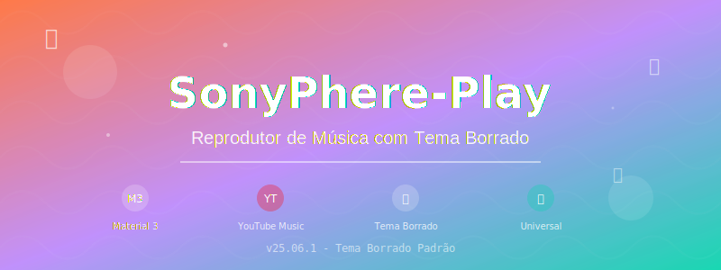
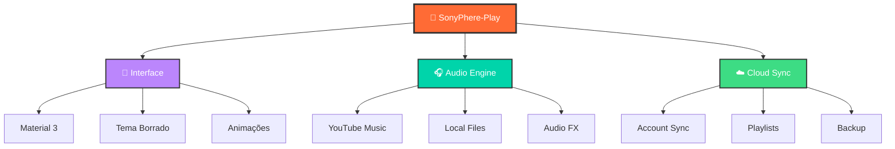

<div align="center">

<!-- Header SVG Animado -->



<p align="center">
  
  
  
</p>

<p align="center">
  
  
  
</p>

---

## 🎨 **Interface Moderna com Tema Borrado**

<div align="center">

</div>

> **✨ Experiência Visual Imersiva ✨**  
> Interface com efeito borrado nas capas dos álbuns, criando uma experiência única e moderna

---

## 🚀 **Características Principais**

<table>
<tr>
<td width="50%">

### 🎵 **Reprodução Avançada**
- 🎧 **YouTube Music** integrado
- 📱 **Reprodução offline** com downloads
- 🔄 **Reprodução em segundo plano**
- 🚫 **Sem anúncios**
- 🎚️ **Normalização de áudio**

</td>
<td width="50%">

### 🎨 **Design Moderno**
- 🌈 **Material Design 3**
- 🔮 **Tema borrado padrão**
- 🌙 **Modo escuro/claro**
- 📱 **Interface responsiva**
- ✨ **Animações fluidas**

</td>
</tr>
<tr>
<td width="50%">

### 📚 **Biblioteca Inteligente**
- 🎼 **Múltiplas filas**
- 📁 **Organização automática**
- 🔍 **Busca avançada**
- 📝 **Metadados completos**
- 🎵 **Arquivos locais**

</td>
<td width="50%">

### 🔗 **Sincronização**
- 👤 **Login YouTube Music**
- ☁️ **Sync completo**
- 📋 **Playlists sincronizadas**
- 💾 **Backup automático**
- 🔄 **Atualização em tempo real**

</td>
</tr>
</table>

---

## 📱 **Versões Disponíveis**

<div align="center">

| 🏗️ **Tipo** | 📏 **Tamanho** | 🎯 **Compatibilidade** | 📁 **Download** |
|:---:|:---:|:---:|:---:|
| **ARM64** | 8.1 MB | Celulares modernos | [](https://github.com/RichardXLR/SonyPhere-Play/releases/download/v25.06.1/SonsPhere-25.06.1-arm64-release.apk) |
| **Universal** | 11 MB | Todos os dispositivos | [](https://github.com/RichardXLR/SonyPhere-Play/releases/download/v25.06.1/SonsPhere-25.06.1-universal-release.apk) |

</div>

---

## 🎨 **Tema Borrado em Ação**

<div align="center">
<svg width="400" height="200" viewBox="0 0 400 200" xmlns="http://www.w3.org/2000/svg">
  <defs>
    <filter id="blur">
      <feGaussianBlur in="SourceGraphic" stdDeviation="15"/>
    </filter>
    <linearGradient id="grad1" x1="0%" y1="0%" x2="100%" y2="100%">
      <stop offset="0%" style="stop-color:#FF6B35;stop-opacity:1" />
      <stop offset="50%" style="stop-color:#BB86FC;stop-opacity:1" />
      <stop offset="100%" style="stop-color:#00D4AA;stop-opacity:1" />
    </linearGradient>
  </defs>
  
  <!-- Background blur effect -->
  <rect x="0" y="0" width="400" height="200" fill="url(#grad1)" filter="url(#blur)" opacity="0.7">
    <animateTransform attributeName="transform" attributeType="XML" type="scale" 
                      values="1;1.1;1" dur="3s" repeatCount="indefinite"/>
  </rect>
  
  <!-- Music note -->
  <text x="200" y="120" font-family="Arial" font-size="60" fill="white" text-anchor="middle" opacity="0.9">
    🎵
    <animateTransform attributeName="transform" attributeType="XML" type="rotate" 
                      values="0 200 120;10 200 120;-10 200 120;0 200 120" dur="2s" repeatCount="indefinite"/>
  </text>
  
  <!-- Text -->
  <text x="200" y="160" font-family="Arial" font-size="16" fill="white" text-anchor="middle" font-weight="bold">
    Tema Borrado Ativo
  </text>
</svg>
</div>

---

## 🛠️ **Recursos Técnicos**

<div align="center">



</div>

---

## 🔥 **Novidades da Versão 25.06.1**

<details>
<summary>🎨 <strong>Tema Borrado Padrão</strong></summary>

- ✅ **Implementado como padrão** em todas as telas
- ✅ **Compatibilidade universal** (removida restrição Android 12+)
- ✅ **Efeito imersivo** nas capas dos álbuns
- ✅ **Performance otimizada** para todas as arquiteturas

</details>

<details>
<summary>📱 <strong>Compilações Otimizadas</strong></summary>

- ✅ **ARM64 Release** (8.1MB) - Performance máxima
- ✅ **Universal Release** (11MB) - Compatibilidade total
- ✅ **Scripts automatizados** para compilação
- ✅ **Instalação simplificada** via ADB

</details>

<details>
<summary>🎵 <strong>Melhorias de Interface</strong></summary>

- ✅ **Componentes modernizados** 
- ✅ **Ícones atualizados**
- ✅ **Animações fluidas**
- ✅ **Modo escuro aprimorado**

</details>

---

## 📥 **Instalação Rápida**

<div align="center">

### 🔧 **Via ADB (Recomendado)**

```bash
# ARM64 (Celulares modernos)
adb install -r SonsPhere-25.06.1-arm64-release.apk

# Universal (Todos os dispositivos)
adb install -r SonsPhere-25.06.1-universal-release.apk
```

### 📱 **Instalação Manual**
1. Baixe o APK: [ARM64](https://github.com/RichardXLR/SonyPhere-Play/releases/download/v25.06.1/SonsPhere-25.06.1-arm64-release.apk) ou [Universal](https://github.com/RichardXLR/SonyPhere-Play/releases/download/v25.06.1/SonsPhere-25.06.1-universal-release.apk)
2. Ative "Fontes desconhecidas" nas configurações
3. Instale normalmente

</div>

---

## ⚠️ **Aviso Importante**

<div align="center">

</div>

> **📍 Restrição Regional**  
> Se você estiver em uma região onde o YouTube Music não é suportado, será necessário usar um proxy ou VPN para se conectar a uma região compatível.

---

## 👨‍💻 **Desenvolvedor**

<div align="center">


<p>
  <a href="https://github.com/RichardXLR">
    
  </a>
</p>

</div>

---

## 📄 **Licença e Isenção**

<div align="center">

</div>

> **⚖️ Isenção de Responsabilidade**  
> Este projeto não é afiliado, financiado, autorizado ou endossado pelo YouTube, Google LLC ou suas afiliadas. Todas as marcas registradas são de propriedade de seus respectivos proprietários.

---

<div align="center">

### 🌟 **Obrigado por usar SonyPhere-Play!** 🌟


**⭐ Se gostou, deixe uma estrela no repositório! ⭐**

</div>

---

<div align="center">

</div>
